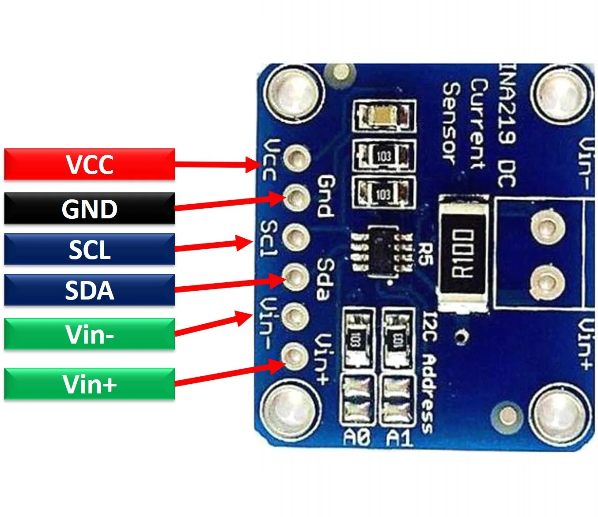

# Monitorowanie Prądu, Napięcia i Mocy za pomocą Modułu INA219

## Wstęp
INA219 to moduł do monitorowania **prądu**, **napięcia**, i **mocy** w obwodach prądu stałego. Używa magistrali **I²C**, co pozwala na prostą komunikację z Raspberry Pi i innymi mikrokontrolerami. Moduł posiada wbudowany rezystor pomiarowy (**shunt resistor**), który mierzy spadek napięcia przy przepływie prądu.





### Funkcje:
- **Pomiar napięcia szyny (Bus Voltage):** Odczyt napięcia na zaciskach VIN+ i VIN-.
- **Pomiar prądu:** Oparty na spadku napięcia na rezystorze pomiarowym (standardowo 0,1Ω).
- **Pomiar mocy:** Obliczenie mocy jako iloczynu prądu i napięcia.
- **Zakres napięcia:** Do 26V (szyna), z dokładnością do 0.8 mV.
- **Zakres prądu:** W zależności od wartości rezystora pomiarowego, np. ±3.2A dla rezystora 0.1Ω.

---

## Podłączenie do Raspberry Pi
1. **Zasilanie modułu:**
   - **VCC** → 3.3V Raspberry Pi.
   - **GND** → GND Raspberry Pi.

2. **Komunikacja I²C:**
   - **SDA** → GPIO 2 (SDA).
   - **SCL** → GPIO 3 (SCL).

3. **Obwód pomiarowy:**
   - **VIN+** → Plus baterii lub źródła zasilania.
   - **VIN-** → Plus obciążenia (np. układu zasilanego przez baterię).

---


### Schemat Połączeń
```plaintext
    Raspberry Pi              INA219                Obciążenie
    ───────────────           ────────             ───────────
    3.3V  ---------------->   VCC
    GND   ---------------->   GND
    GPIO 2 (SDA) --------->   SDA
    GPIO 3 (SCL) --------->   SCL

    VIN+ ------------------> Plus Baterii
    VIN- ------------------> Plus Obciążenia
```
 

## Przykładowe Zastosowania
- Monitorowanie poziomu naładowania baterii.
- Pomiar zużycia energii przez urządzenia w obwodzie.
- Diagnostyka systemów zasilania prądem stałym.

Moduł INA219 jest idealnym narzędziem do analizy wydajności energetycznej w projektach IoT i elektronice mobilnej.

